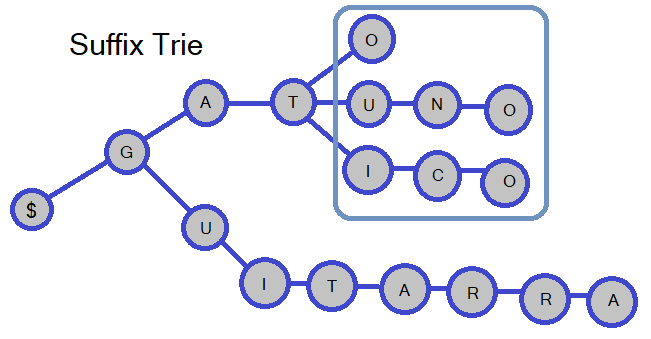

# Moogle!

> Proyecto de Programación I. Facultad de Matemática y Computación. Universidad de La Habana. Curso 2022.

---
# Search Engine:
The search engine uses vectorial models to find the text that most closely resembles the query.First we vectorize the text and the queries using `TF-IDF` :
  
$tfidf=(\frac{f}{Tf})* log_{2}(\frac{Nt}{Df})$  

Where $f$ is the term frequency in the current text, $Tf$ is the term frecuency over all texts, $Nt$ is the number of texts and $Df$ is the number od texts in which the term appears.

After that for every query we can pass through all the text's vectors and see how close they are. To see that we can find the angle between the vector by the formula:

$\alpha=arcos{\frac{{a}\cdot{b}}{{a}\cdot{a}}}$ 

I decided to only use te `dot product` of the vector because is more easy to calculate.

  

# Word Similarity
## Looking for the most similar word:
Mistakes happen, sometimes we write words wrong or we put capital letters where they don't belong, that's why it is necessary to distinguish that these words are the same.  
To do that i used the `Edit Distance` algorithm. It gives you the number of operations that you have to do to one of the strings to convert it to the other. I realized that sometimes this is not the most optimal aproach, for example word `distra` is closer tto `citra` than `distra` to `dijkstra`, and i think that it shouldnt be like that, so i created my own distance formula:  
$d=\frac{editdistance}{lcp}$   
Where $lcp$ is the longes common prefix. Based on the intuition that mistakes in the first letters are worst that in the last ones.

## Looking for the words that are family:
In most languages, words are made up of a lexeme and a morpheme. Words that have the same lexeme usually belong to the same grammatical family, and tend to have similar meanings, so they are also important for the search.
For example in spanish, if we have the word `programaba`, we can say that the words `programé`, `programabas` and `programaste`  are important too to the search, so we have to add them to the query.  
One approach to this is to have a database with all the families of balabras, lexemes, or morphemes, but this didn't seem like an elegant solution to me.
I decided to use a Trie Data Structure to find the words that belongs to the same family.  
  

  
  
For example, assuming that we want the words that are family of `programaba`, we look for all the words that end in some node that belongs to the subtree of the prefix `progra` (we remove the last $eps$ letters from the word, in this case $eps=4$) .

## Looking for synonyms:
The obvious approach is to have a database of all the synonyms, and for each word look up what its synonyms are.  
I found an [API](http://sesat.fdi.ucm.es:8080/Web/sinonimos.html) that provides synonyms of words so I decided to use it instead of a database.

> ⚠️ When the computer does not have internet it can take a little longer than normal because it tries to communicate with the API

---
# Operators

---
# GUI:  
I don't really like to code in HTML or CSS, but I tried to create a minimally pretty graphical user interface. I also added the functionality that when you click on a file name it opens a new tab with the file.

---
# Computational complexity analysis:

## Finding the most similar word:
## Finding the words that are family:
## Finding synonyms:
---
# Further Optimizations:
## K-Dimentional Tree
## GPU's go brrrr! 🔥
---

